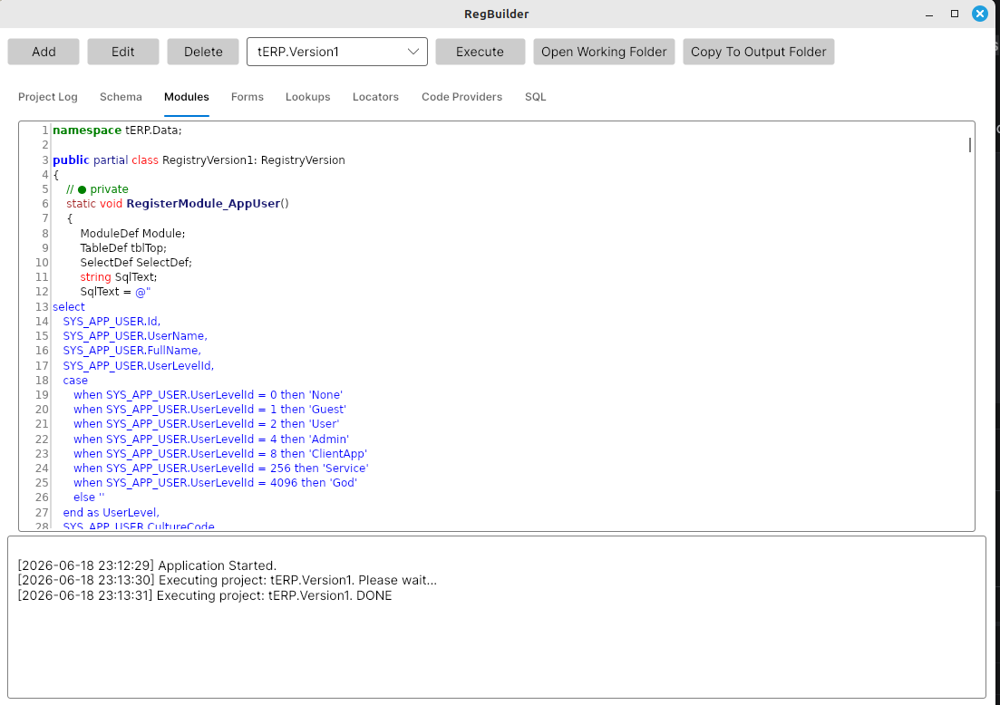
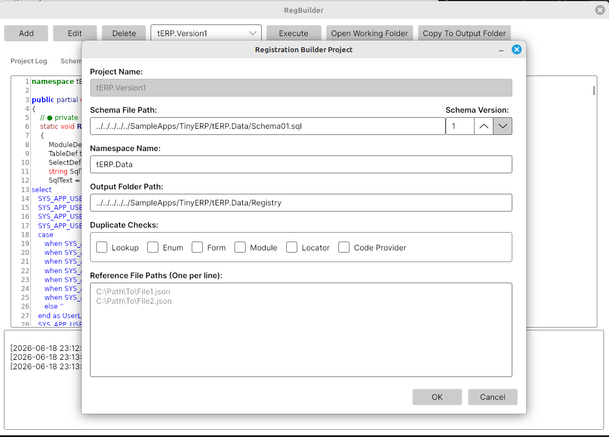

# Registration Builder

The Registration Builder is the Tripous tool that reads `Schema.sql` files and generates C# registration code.

It is used when an application wants automatic declaration instead of writing all Tripous descriptors by hand.

The tool exists in two application forms:

- `Tools/RegBuilder` is the UI version.
- `Tools/RegBuilderConsole` is the console version.

Both versions use the same core generation engine, `SchemaRegistrationBuilder`.

They differ mainly in workflow.

- the UI version is useful for visual inspection, experimentation and reviewing generated source in tabs
- the console version is useful for repeatable generation, scripts and source-controlled application workflow

The console version copies generated C# files to the configured application folder automatically.

The UI version generates files in its own working folder, displays the generated source in the application tabs and copies generated C# files to the configured application folder only when the user explicitly requests it.

It is not a different runtime architecture.

It writes the same declarations a developer could write manually with `ModuleDef`, `FormDef`, `LookupSource`, `LocatorDef`, `SelectDef` and `TableDef`.

```text
Manual registration
    == same descriptors ==
Generated registration
```

## Input

The main input is a SQL schema file written with Tripous provider-neutral tokens and metadata comments.

The schema file acts as a compact declaration language.

It contains:

- table definitions
- field definitions
- primary keys and foreign keys
- provider-neutral SQL tokens
- table header metadata
- field metadata

Example:

```sql
/*---------------------------------------------------
Table: Product
Module: Product ProductDataModule
Group: Inventory
Form: Product ProductForm
FilterFields: Code, Name, ProductGroup__Name
IsLookup
----------------------------------------------------*/
CREATE TABLE {TableName} (
    Id @NVARCHAR(40) @NOT_NULL primary key,
    Code @NVARCHAR(40) @NOT_NULL,          -- Code PRD-YYYY-XXXXXX
    Name @NVARCHAR(96) @NOT_NULL,
    ProductGroupId @NVARCHAR(40) @NULL,    -- Lookup
    ProductGroupName @NVARCHAR(96) @NULL,  -- Snapshot ProductGroup.Name
    IsActive @BOOL default 1 @NOT_NULL,

    FOREIGN KEY (ProductGroupId) REFERENCES ProductGroup(Id)
    )
```

From this single block the builder can infer database structure, module registration, form registration, lookup metadata, filter fields, code providers and table descriptor details.

## Project Configuration

The builder uses project configuration to know which schema file to parse and where generated files should go.

A project definition contains:

- project name
- schema file path
- namespace name
- schema version
- duplicate-check behavior
- optional reference schema files
- output folder

Example console configuration:

```json
{
  "BuildProjectFilePaths": [
    "../../../../../SampleApps/TinyERP/tERP.Common/tERP.Common.csproj"
  ],
  "AssemblyFilePaths": [
    "../../../../../SampleApps/TinyERP/tERP.Common/bin/{Configuration}/net10.0/tERP.Common.dll"
  ],
  "Projects": [
    {
      "Name": "tERP.Version2",
      "SchemaFilePath": "../../../../../SampleApps/TinyERP/tERP.Data/Schema02.sql",
      "NamespaceName": "tERP.Data",
      "SchemaVersion": 2,
      "DuplicateChecks": "None",
      "ReferenceFilePaths": [
        "../../../../../SampleApps/TinyERP/tERP.Data/Schema01.sql"
      ],
      "OutputFolderPath": "../../../../../SampleApps/TinyERP/tERP.Data/Registry"
    }
  ]
}
```

`{Configuration}` is replaced by the selected build configuration, such as `Debug` or `Release`.

TinyERP uses two configured projects:

- `tERP.Version1`
- `tERP.Version2`

Version 2 references `Schema01.sql` so the builder can understand previous schema objects while generating the new version.

## Processing

The Registration Builder processes the schema in this order:

- parses table headers, fields and foreign keys
- validates metadata rules
- validates lookup, enum, locator and snapshot references
- validates `DetailOrder` and `FilterFields`
- resolves table dependencies
- calculates table creation order
- rebuilds schema SQL in dependency order
- injects `CreationOrder` into rebuilt headers
- collects code provider patterns
- generates Tripous C# registration source code

`CreationOrder` is generated output.

It is not required in the input schema.

The rebuilt ordered schema text is available through `SchemaParserResult.SchemaSql`.

## Output

The generated output includes:

- ordered schema SQL
- schema version classes
- registry version classes
- module declarations
- form declarations
- lookup source declarations
- locator declarations
- select definitions
- table registration code
- code provider seed statements

For a schema version `N`, the generated files are:

- `SchemaVersionN.cs`
- `RegistryVersionN.cs`
- `RegistryVersionN.Modules.cs`
- `RegistryVersionN.Forms.cs`
- `RegistryVersionN.Lookups.cs`
- `RegistryVersionN.Locators.cs`
- `RegistryVersionN.CodeProviders.cs`

Generated files contain a header like this:

```text
This file was generated by Tripous RegBuilder.
```

They should not be edited manually.

When generated output needs to change, change the schema metadata and run the builder again.

## UI Tool

Tripous includes `Tools/RegBuilder`.

It is useful while developing metadata because it shows generated output immediately.

The UI tool displays generated source in tabs:

- schema registration
- modules
- forms
- lookups
- locators
- code providers
- rebuilt SQL

It also writes generated files to an `Output` folder under the running tool folder.

That folder is the UI working folder.

The UI has a separate `Copy To Output Folder` command.

That command copies generated C# files from the working folder to the selected project's configured `OutputFolderPath`.

This keeps `Execute` safe for inspection and makes overwriting application files an explicit action.

The main UI shows the configured projects, execution commands and generated output tabs.



The project settings dialog defines the schema file, namespace, schema version, output folder, duplicate checks and reference schema files.



## Console Tool

Tripous includes `Tools/RegBuilderConsole`.

It is useful for repeatable generation from command line, scripts and CI workflows.

Usage:

```text
dotnet run --project Tools/RegBuilderConsole -- [options]
```

Common options:

- `--project Name` runs only one configured project.
- `--configuration Debug|Release` selects build configuration.
- `--no-build` skips configured project builds.
- `--help` displays usage.

TinyERP version 2 can be regenerated with:

```text
dotnet run --project Tools/RegBuilderConsole -- --project tERP.Version2
```

When assemblies are already current:

```text
dotnet run --project Tools/RegBuilderConsole -- --project tERP.Version2 --no-build
```

The console tool:

- loads `AppSettings.json`
- builds configured projects unless `--no-build` is used
- loads configured assemblies
- runs selected RegBuilder projects
- generates files in a temporary folder
- copies generated C# files to the configured output folder
- does not copy `Schema.sql` to the registry folder

The configured output folder is declared per project.

Example:

```json
{
  "Name": "tERP.Version2",
  "SchemaFilePath": "../../../../../SampleApps/TinyERP/tERP.Data/Schema02.sql",
  "NamespaceName": "tERP.Data",
  "SchemaVersion": 2,
  "DuplicateChecks": "None",
  "ReferenceFilePaths": [
    "../../../../../SampleApps/TinyERP/tERP.Data/Schema01.sql"
  ],
  "OutputFolderPath": "../../../../../SampleApps/TinyERP/tERP.Data/Registry"
}
```

For tERP, this means the generated files are copied directly into `SampleApps/TinyERP/tERP.Data/Registry`.

## Type Discovery

Some generated registrations need existing .NET types.

Examples:

- enum types used by enum lookups
- custom data module classes
- custom form classes
- custom locator classes
- custom lookup source classes

The console tool can build configured projects and load configured assemblies before generation.

This lets the builder validate and reference application types while generating registration code.

## Result

The result is normal Tripous registration code.

Manual registration and generated registration use the same runtime registry.

```text
Schema.sql
    -> Registration Builder
    -> Generated C#
    -> Tripous registry declarations
```

The generated C# code is compiled with the application like any other source file.

At runtime, Tripous does not care whether the descriptors came from handwritten code or generated code.

## What The Builder Does Not Do

The Registration Builder does not own business logic.

It does not generate:

- document posting rules
- services
- validators
- application workflows
- sample data
- custom UI behavior

Those parts remain normal application code.

The builder handles structural declaration.

The developer keeps control of behavior and extensions.
