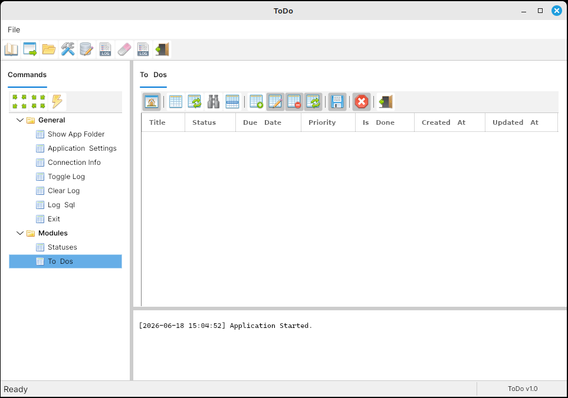
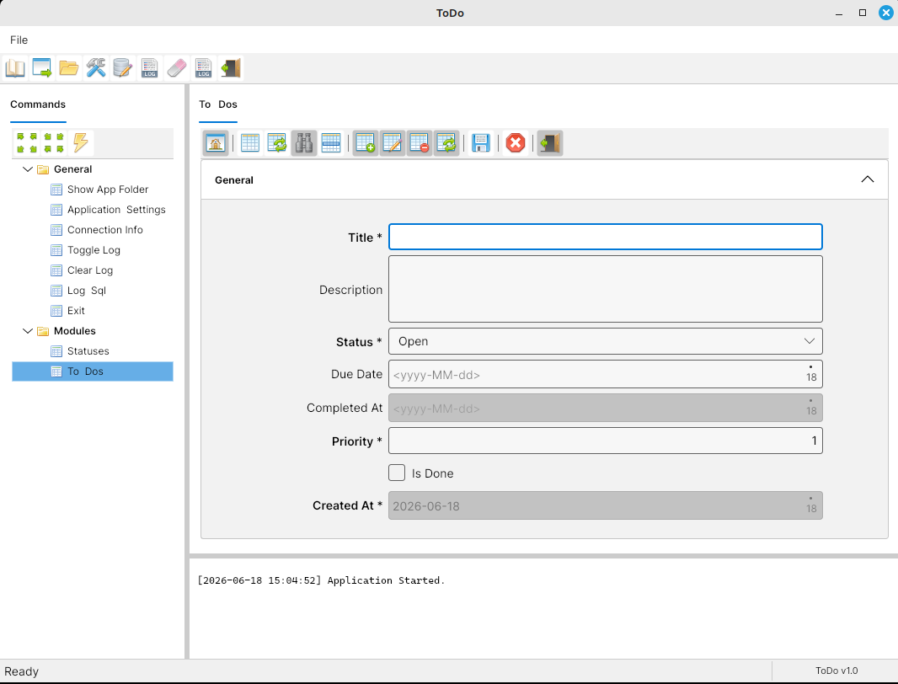
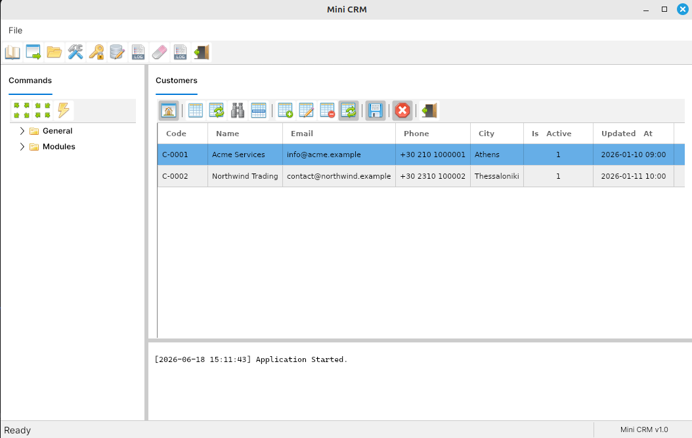
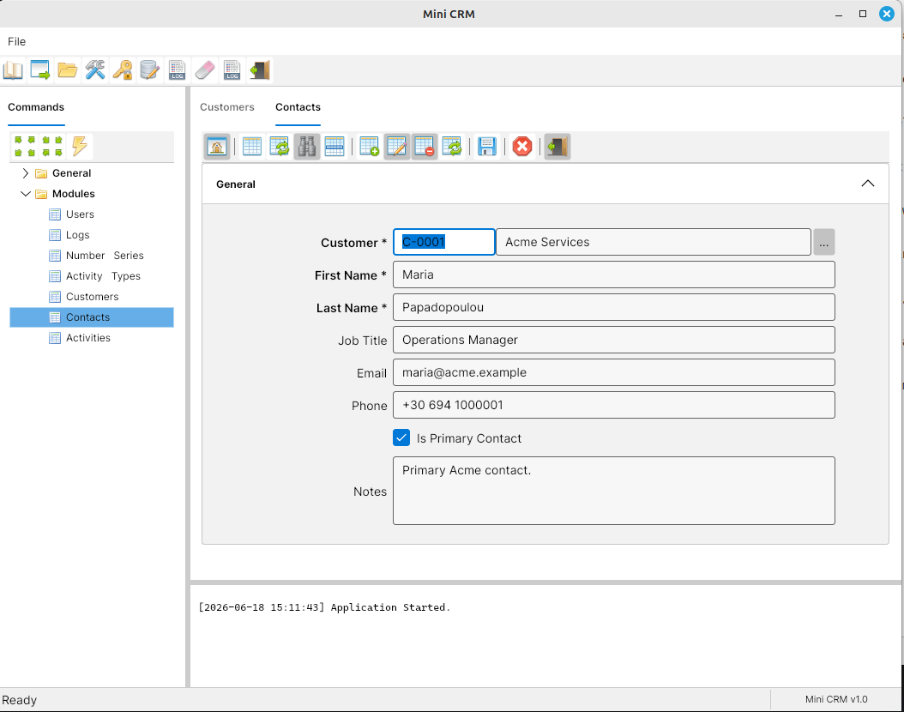
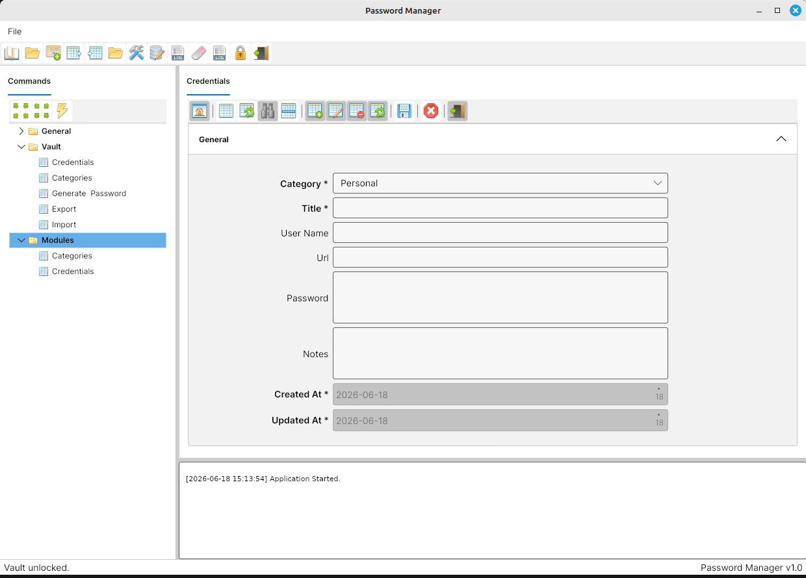
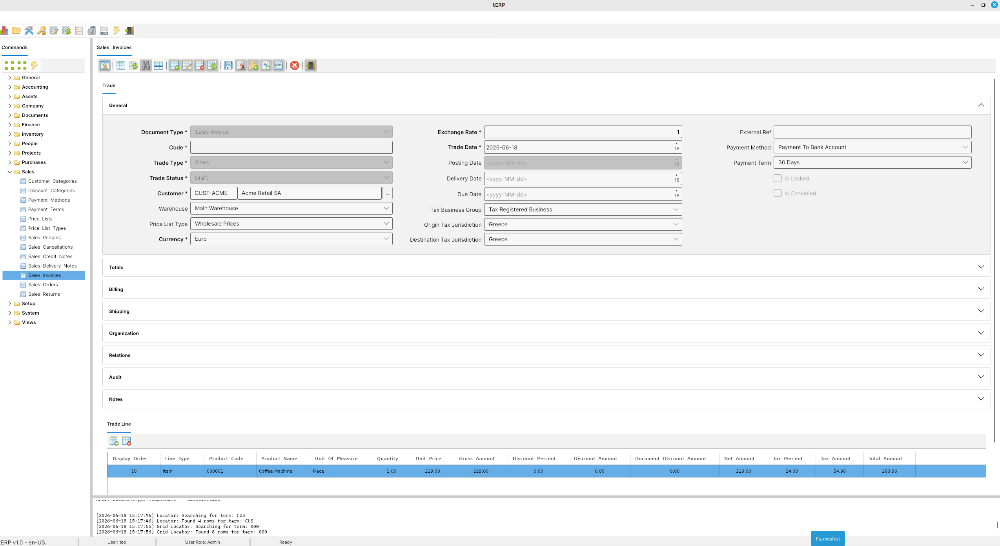
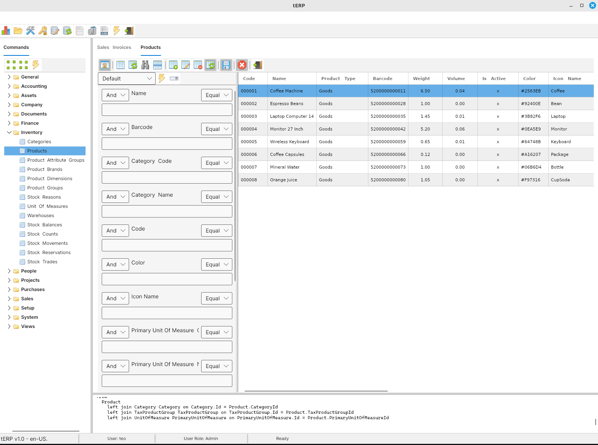
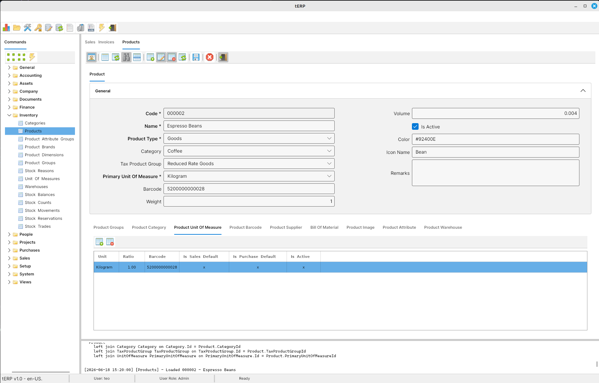
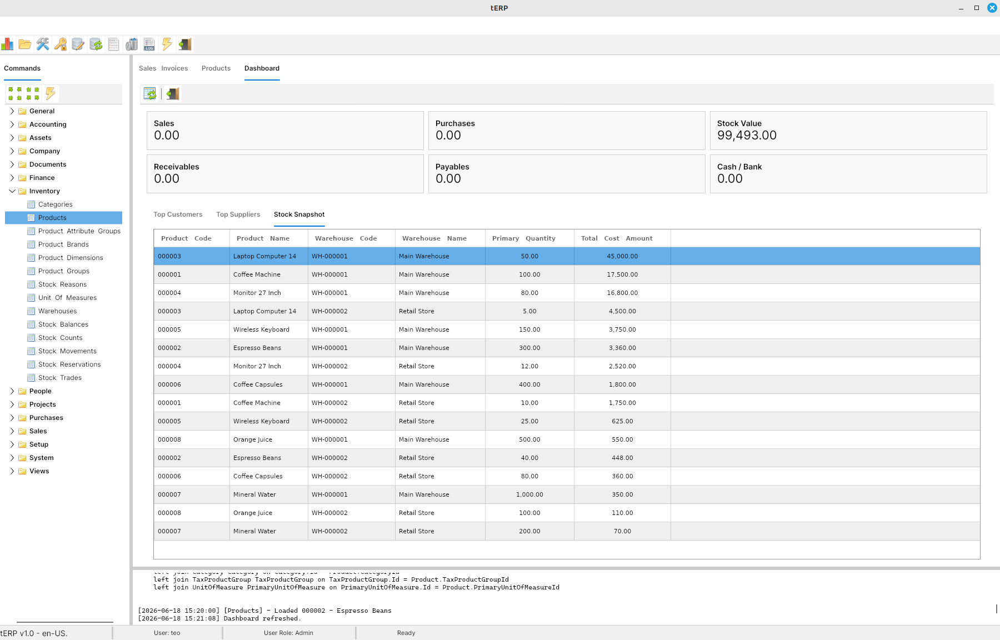

# Screenshots

## 03-todo

Todo list view with filters and the task grid.

Todo item form with the basic edit experience.

## 04-mini-crm

Customer list with generated customer codes.

Contact item form with lookup and locator fields.

## 05-password-manager

Credential list view.

 

## TinyERP

Sales invoice item form with master and detail lines.

Product list.

Product item.

Dashboard.

