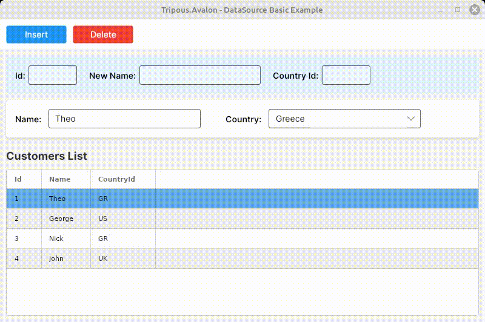

# Tripous.Avalon - Introduction to BindingSource



The `BindingSource` is the heart of **Tripous.Avalon**. It acts as a powerful controller and abstraction layer between your data and the UI, designed specifically to solve the challenges of data-heavy enterprise applications.

## The Philosophy: Why BindingSource?

Most UI frameworks rely on static, design-time XAML bindings. While this works for simple forms, professional applications often require **Runtime Dynamics**:
- UI layouts that change based on user permissions or data state.
- Data schemas (like dynamic tables) that are only known at runtime.
- The need for robust **Currency Management** (tracking the "Current" record across multiple controls).

`BindingSource` fills this gap by moving the binding logic into a centralized, programmable object.

## Core Architecture

Unlike simple collections, a `BindingSource` manages data in two layers:
- **AllRows (The Source):** The complete set of data loaded from your provider.
- **Rows (The View):** A dynamic, filtered, and observable collection of rows currently visible in the UI.

This separation allows for high-performance filtering and master-detail synchronization without losing the original data context.

## Initializing a BindingSource

The framework treats `DataTables` and `Generic Lists` with equal respect. You can create a source from either type using a unified API:

```csharp
// Initialize from a System.Data.DataTable
dsCustomer = BindingSource.FromTable(myDataTable);

// Initialize from a POCO List
dsCustomer = BindingSource.FromList(myCustomerList);
```

## Simplified Runtime Binding

With `BindingSource`, you bind your UI programmatically. This keeps your XAML clean and your logic centralized.

### 1. Binding Grids and Forms
You can bind a `DataGrid` and individual input controls with single method calls:

```csharp
// Bind a DataGrid and auto-generate columns
dsCustomer.Bind(gridCustomers, true);

// Bind a simple TextBox to a specific field
dsCustomer.Bind(edtName, "Name");
```

### 2. Lookup Bindings
One of the most powerful features is the built-in support for lookup controls (like a ComboBox that maps an ID to a Name):

```csharp
// Maps Customer.CountryId to Country.Name using Country.Id as the key
dsCustomer.Bind(cboCountry, dsCountry, "Name", "Id", "CountryId");
```

## CRUD Operations

The `BindingSource` provides a standardized way to manipulate data regardless of the underlying source type.

### Adding Records
When adding a row, you can access fields using a simple string indexer:

```csharp
void Insert()
{
    BindingSourceRow Row = dsCustomer.NewRow();
    Row["Id"] = edtNewId.GetText();
    Row["Name"] = edtNewName.GetText();
    Row["CountryId"] = edtNewCountryId.GetText();
    dsCustomer.AddRow(Row);
    
    // The framework handles internal updates and notifications
}
```
### Deleting Records
Deleting a record is a single call that handles UI notification and collection cleanup automatically:

```csharp
void Delete()
{
    dsCustomer.Delete();
}
```


## Advanced Record Creation: NewRow vs AddRow

To ensure data integrity, especially in Master-Detail scenarios, the framework separates the creation of a row from its insertion into the data source.

### The "Offline" Phase: `NewRow()`
This method creates a new `BindingSourceRow` instance without adding it to any collection. This is where you initialize your primary keys or default values.

```csharp
var row = bsMaster.NewRow();
row["Id"] = "CUST-001";
row["Name"] = "Acme Corp";
```

### The "Publishing" Phase: `AddRow()`
Once the row is ready, `AddRow()` performs the following:
- **Auto-Key Sync:** If the row is a Detail and its Foreign Key is missing, the framework automatically assigns the current Master's ID.
- **Validation:** Fires the `OnAdding` event (which can be canceled).
- **Visibility:** Checks if the new row passes current filters.
- **Currency:** Sets the new row as the `Current` record, triggering updates to all bound UI controls and child details.

```csharp
bsMaster.AddRow(row);
```

### The "Fluent" Shortcut: `AddRow(params object[] Values)`
For quick data entry or seeding, you can add a row in a single line. Values are mapped by the order of columns in the data source.

```csharp
bsCountry.AddRow(1, "Greece", "GR");
bsCountry.AddRow(2, "Italy", "IT");
```

## Key Features at a Glance

- **Unified API:** Use the same code for `DataTable` and `List<T>`.
- **Automatic Currency:** All bound controls stay in sync as the user moves through the data.
- **Lifecycle Events:** Built-in hooks for `OnAdding`, `OnAdded`, `OnDeleting`, and `OnDeleted` for business logic validation.
- **Smart Data Access:** Access any value through `BindingSourceRow[columnName]`.

 