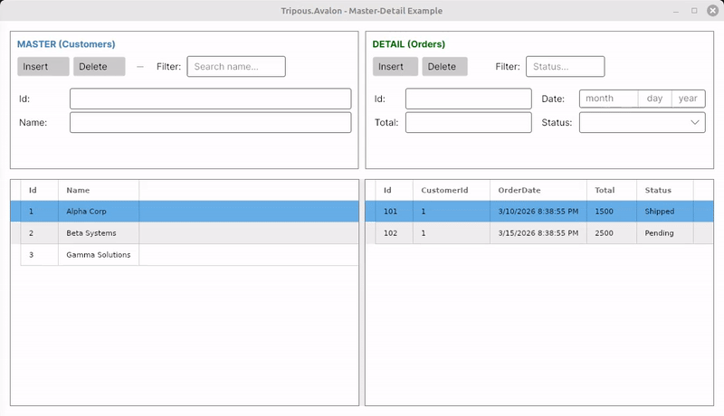

# Master - Detail Relationships & Filtering

Managing related data (Master-Detail) is one of the most demanding aspects of building business applications. 

**Tripous.Avalon** simplifies this process, allowing developers to define relationships between `BindingSources` with a single line of code, automatically handling UI synchronization and data integrity.



## Setting Up a Relationship

To connect two `BindingSources`, we use the `AddDetail()` method. This creates a link where the "Detail" source monitors changes in the "Master" source and filters itself automatically.

```csharp
// Establish a relationship: Customer (Master) -> Orders (Detail)
// "CustOrders" is the unique name of the relation
// "Id" is the primary key in Master
// "CustomerId" is the foreign key in Detail
bsMaster.AddDetail("CustOrders", "Id", bsDetail, "CustomerId");

// Enable the relationship
bsMaster.ActivateDetails(true);
```

### Key Behaviors:
- **Auto-Sync:** When the user selects a different record in the Master Grid, the Detail Grid updates instantly to show only the relevant records.
- **Empty State:** If the Master source is empty or no record is selected, the Detail source automatically hides all its records.

## Data Integrity & Cascade Delete

One of the framework's strongest features is ensuring data integrity during CRUD operations.

### 1. Auto-Key Assignment
When calling `bsDetail.Add()`, the framework detects that the source is a "child" in a relationship. It automatically assigns the Master's key value (e.g., the Customer's `Id`) to the corresponding field in the new Detail record (e.g., `CustomerId`). The developer no longer needs to manually write:
`NewRow["CustomerId"] = bsMaster.Current["Id"];`

### 2. Recursive Cascade Delete
Deleting a Master record can lead to "orphan" records. The `BindingSource` supports **Cascade Delete**:
- When a Master record is deleted, the framework looks for all related records in the Detail sources.
- The deletion is **recursive**: if the Detail has its own "children," the deletion cascades through the entire hierarchy.
- The process is safe as it targets the underlying data (`fAllRows`) rather than just the UI view.

## Simple Filtering System

The `BindingSource` provides an easy way for real-time data searching via the `SetFilter()` method.

```csharp
// Simple 'Contains' search (case-insensitive)
bsMaster.SetFilter("Name", "Alpha"); 

// Wildcard support: StartsWith search
bsMaster.SetFilter("Name", "Al*"); // Matches 'Alpha', 'Albert', but not 'Beta Alpha'
```

### How it works:
- **Contains:** By default, the search checks if the value is contained anywhere within the field.
- **Wildcard (*):** If the user adds an asterisk at the end, the system automatically switches to "Starts With" mode.
- **Cancel Filter:** Using `CancelFilter()` returns the source to its original state (showing all records allowed by the Master-Detail relationship).

## The Future: Advanced Expressions

The current filtering system is designed for speed and simplicity. In the near future, the framework will expand with:
- **Full Expression Parser:** Support for complex filters with logical operators (e.g., `(Status == 'Pending' AND Total > 100) OR Priority == 1`).
- **Dynamic Predicates:** Support for custom filtering functions defined at runtime.