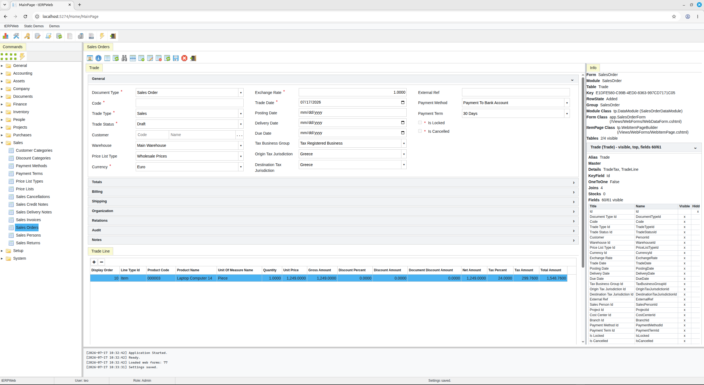
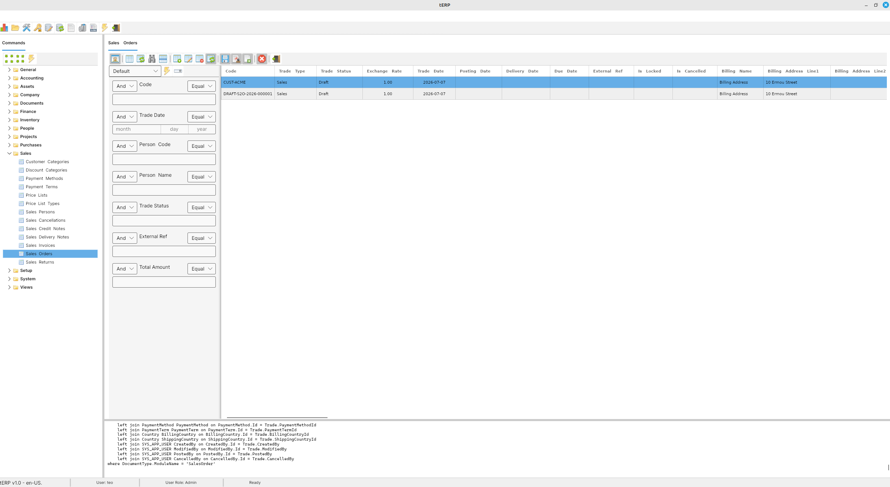
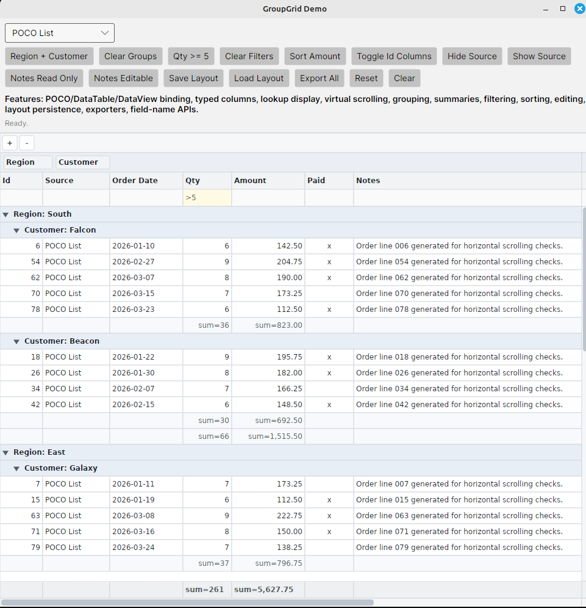
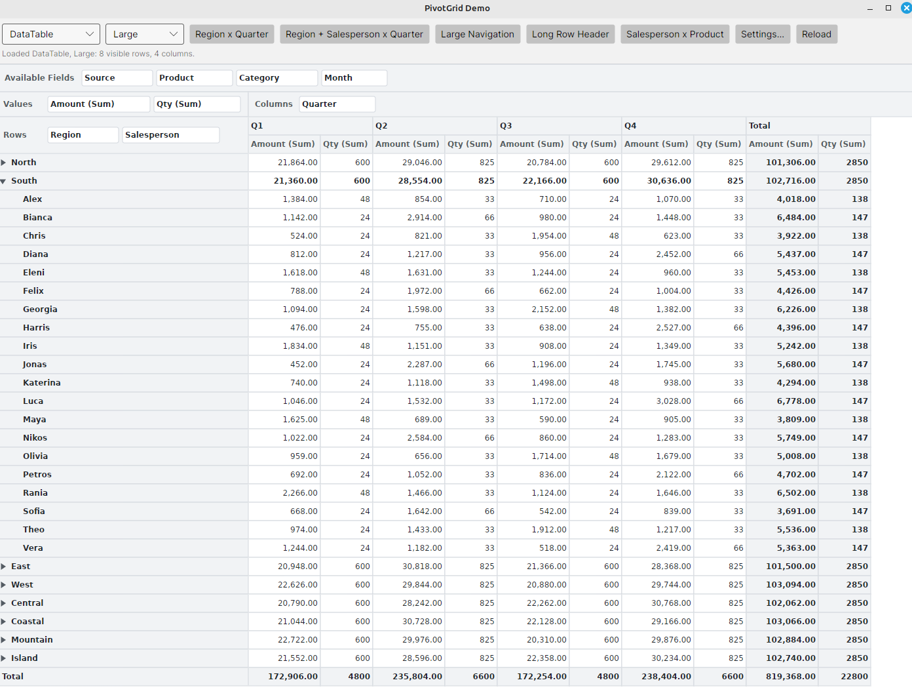

# Tripous.Avalon

Tripous.Avalon is a .NET framework for building data-centric business applications on desktop, web, service, and database platforms.

It combines SQL-first data access, database metadata, application descriptors, reusable data modules, generated or manual application registration, and an Avalonia-based desktop layer.

Documentation:

- https://tbebekis.github.io/Tripous.Avalon/
- https://tbebekis.github.io/Tripous.Avalon/web-demos/

> Second public release of the sixth-generation Tripous framework family, built on .NET and Avalonia UI.

## What Can You Build With Tripous.Avalon?

Tripous.Avalon targets data-centric business software that can be delivered both as desktop applications and as desktop-like web applications.

The desktop layer is multi-OS thanks to Avalonia, while the web layer is intended for desktop-like data entry applications in the browser.

Examples include:

- ERP systems.
- CRM systems.
- Accounting and finance applications.
- Inventory and warehouse management systems.
- Sales and purchase management systems.
- Order processing applications.
- Invoicing and billing systems.
- Document-based business workflows.
- Back-office administration tools.
- Internal line-of-business applications.
- Master-data management tools.
- Reporting and inquiry applications.
- Database maintenance and configuration tools.
- Desktop database applications.
- Web-based data entry applications.
- Service-backed business applications.
- Multi-database business systems.

**Web**



**Desktop**



## What Is Tripous?

Tripous is an application framework.

It is neither a UI toolkit nor an ORM.

The framework provides infrastructure commonly needed by business applications:

- Database schema registration.
- SQL-oriented data access.
- Metadata descriptors and registries.
- Data modules.
- Modules, tables, fields and forms.
- System string resources and localization.
- Lookups and locators.
- Select definitions and filters.
- Code providers and number series.
- Master/detail data management.
- Application configuration.
- Logging infrastructure.
- Avalonia desktop application infrastructure.

The goal is to let developers describe the application structure explicitly while keeping full control over business logic and application behavior.

## Main Libraries

The repository contains the following framework libraries.

- `Tripous`: Core utilities, configuration, type services, collections, descriptors and shared infrastructure.
- `Tripous.Data`: Database access, schema execution, SQL providers, data modules, table sets, lookups, locators and data descriptors.
- `Tripous.Logging`: Logging infrastructure and diagnostics.
- `Tripous.Avalonia.Controls`: Framework-neutral Avalonia controls such as `GroupGrid` and `PivotGrid`.
- `Tripous.Desktop`: Avalonia-based desktop layer with forms, menus, toolbars, commands, data forms and application UI infrastructure.
- `Tripous.Web`: ASP.NET Core infrastructure and WebDesk browser UI layer for desktop-like business data applications.

## Controls

### Group Grid



### Pivot Grid



## Application Declaration

Tripous applications are built from descriptors.

Descriptors define:

- Modules.
- Tables and fields.
- Forms.
- Lookups.
- Locators.
- Select definitions.
- Code providers.
- Configuration properties.

There are two declaration paths.

- Manual declaration: the developer writes the descriptors directly in C#.
- Automatic declaration: the Registration Builder reads schema files and metadata comments, then generates the same descriptors automatically.

Both paths use the same runtime model.

The Registration Builder is not a separate architecture. It generates the same declarations a developer could otherwise write by hand.

## Sample Applications

The `SampleApps` folder contains progressively larger samples.

- `01-hello-tripous`: Smallest desktop shell. No database.
- `02-notes`: First SQLite-backed module and form.
- `03-todo`: Lookups, filters, configuration and a more realistic startup flow.
- `04-mini-crm`: Main manual declaration sample with master/detail forms, locators, lookups and code providers.
- `05-password-manager`: Services, encrypted fields, import/export and vault locking. Educational sample only and not intended for production security use.
- `TinyERP`: Larger multi-project ERP-style sample using the Registration Builder and generated declarations, delivered as both a desktop ERP and a desktop-like web ERP.

Sample applications are educational material and reference implementations, not production applications.

TinyERP currently demonstrates:

- Desktop and web ERP-style applications over the same data and business layer.
- Multilingual application text using supported languages and system string resources.
- Administrator-maintained resource translations with English fallback.
- Sales, purchase, warehouse, finance and accounting workflows.
- Document posting, cancellation, transformation and settlement flows.
- Database Explorer, Interactive SQL, dashboards and read-only views.
- Generated data forms plus custom desktop and web forms.
- Workflow-oriented automated tests and targeted manual smoke tests.

## Tripous.Avalonia.Controls

`Tripous.Avalonia.Controls` is a reusable Avalonia controls library hosted in this repository.

It remains independent from the Tripous framework:

- no dependency on `Tripous`
- no dependency on `Tripous.Data`
- no Tripous descriptors, registries, data modules, lookups, or locators in the public API

Current controls:

- `GroupGrid`: a custom-rendered business grid for dense data-entry screens, grouping, summaries, filtering, sorting, editing, settings, and export.
- `PivotGrid`: a custom-rendered pivot grid for row/column axes, measures, aggregates, filtering, sorting, field drag/drop, settings, and export.

The controls project includes demos and tests:

- `Tripous.Avalonia.Controls/Demos/GroupGrid-Demo-00`
- `Tripous.Avalonia.Controls/Demos/PivotGrid-Demo-00`
- `Tripous.Avalonia.Controls/Tests/GroupGrid-Tests`
- `Tripous.Avalonia.Controls/Tests/PivotGrid-Tests`

See:

- `Tripous.Avalonia.Controls/ReadMe.md`
- `Tripous.Avalonia.Controls/Docs/GroupGrid-Concepts.md`
- `Tripous.Avalonia.Controls/Docs/PivotGrid-Concepts.md`

## TinyERP

`SampleApps/TinyERP` is the largest sample application.

It is the same sample ERP implemented in two front ends: an Avalonia desktop application and an ASP.NET Core desktop-like web application. Both use the same shared TinyERP data/business layer and demonstrate the same ERP domain from desktop and web.

It demonstrates:

- Multi-project application structure.
- One ERP sample delivered as both desktop and web applications.
- Automatic registration with the Registration Builder.
- Schema metadata comments.
- Generated modules, forms, lookups, locators, select definitions and code providers.
- Shared desktop and web string-resource localization.
- Administrator-maintained resource translations.
- Sales and purchase documents.
- Stock documents.
- Journal entries.
- Finance movements and balances.
- Customer receipts and supplier payments.
- Unit tests and workflow-oriented tests.

See:

- `SampleApps/TinyERP/ReadMe.md`

## Documentation Project

The documentation site is located under:

- `DocFx`

Important files:

- `DocFx/index.md`
- `DocFx/toc.yml`
- `DocFx/docs/toc.yml`
- `DocFx/docfx.json`

Conceptual documentation lives under:

- `DocFx/docs`

Generated API documentation is produced by DocFX from XML comments.

Do not manually edit generated output under:

- `DocFx/_site`
- `DocFx/api`

## Tripous.Web Demos

The repository includes a standalone static demo site for the Tripous.Web JavaScript runtime and controls.

- Source: `WebDemos`
- Published URL: https://tbebekis.github.io/Tripous.Avalon/web-demos/

The WebDemos site is plain HTML, CSS and JavaScript. It is independent from the ASP.NET Core demo application and can be published as part of the DocFX GitHub Pages site.

tERPWeb is the ASP.NET Core MVC TinyERP Web sample under `SampleApps/TinyERP/tERPWeb`.

It includes a desktop-like web shell, command tree, database explorer, interactive SQL, generated data forms, document workflow forms and the Resource Translations admin form.

When testing tERPWeb, run a full rebuild of the `tERPWeb` project first. The rebuild creates the generated Tripous Web bundles such as `tp.js`, `tp-Data.js`, `tp-UI.js`, `tp-Grid.js` and `tp-WebDesk.js` from the source fragments under `wwwroot/js-src`.

## Tools

The `Tools` folder contains developer tools.

The most important tool is the Registration Builder console.

Example:

```text
dotnet run --project Tools/RegBuilderConsole -- --project tERP.Version2
```

The tool reads configured schema files and generates Tripous registry code.

## Database Support

Tripous uses SQL providers and database-neutral schema tokens.

Supported relational database engines include:

- SQLite.
- Microsoft SQL Server.
- MySQL.
- PostgreSQL.
- Firebird SQL.
- Oracle Database.

Schema SQL can use provider-neutral tokens such as:

- `@NVARCHAR(size)`
- `@DATE`
- `@DATE_TIME`
- `@BOOL`
- `@NBLOB_TEXT`
- `@NOT_NULL`
- `@NULL`

Providers translate those tokens into the target RDBMS dialect.

## Development Notes

The solution file is:

- `Tripous.Avalon.sln`

Useful folders:

- `Tripous`
- `Tripous.Data`
- `Tripous.Logging`
- `Tripous.Desktop`
- `SampleApps`
- `Tools`
- `UnitTests`
- `DocFx`

For Tripous.Desktop-focused work, a scoped build is usually sufficient.

```text
dotnet build Tripous.Desktop/Tripous.Desktop.csproj
```

Do not edit generated Registration Builder output directly.

For TinyERP schema changes, edit the schema files and regenerate the registry source code.

## Status

Tripous.Avalon is actively developed.

Current priorities include:

- Framework stabilization.
- Conceptual documentation.
- Sample applications.
- Registration Builder workflow.
- XML documentation cleanup.
- Automated testing.
- Desktop and web runtime stabilization and feature parity.

## License

Tripous.Avalon is licensed under the Tripous.Avalon Community License v1.0.

See:

- `LICENSE.txt`
